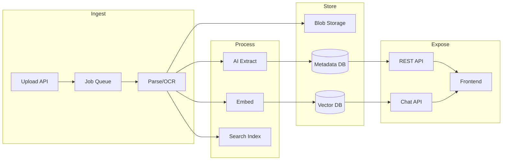

# AI-Driven Document Automation — One-Page Proposal

**Allegro Nordic | Technical proposal for case presentation | March 2025**

---

## Architecture (high level)

Upload → **Queue** → **Parse** (text/OCR) → **Blob storage**. From parsed text: **(1)** AI extraction → **Metadata DB** (PostgreSQL); **(2)** chunk → embed → **Vector DB** + full-text **Search index**. Expose via **REST API** (metadata CRUD, search) and **Chat API** (RAG over documents). **Frontend** for list/detail/edit metadata and chat UI.

---

## Tech stack

| Layer        | Choice                          |
|-------------|----------------------------------|
| Blob        | S3 / Azure Blob / GCS (or MinIO) |
| Queue       | SQS / RabbitMQ / Redis (Bull)    |
| Parse       | Apache Tika + PyMuPDF            |
| OCR         | Tesseract or cloud (Textract)    |
| Extraction  | LLM (structured output)          |
| Embeddings  | OpenAI / Cohere / open model     |
| Vector DB   | pgvector / Pinecone / Weaviate   |
| Metadata DB | PostgreSQL                       |
| Search      | Postgres FTS / Elasticsearch     |
| API         | REST (Node/Python/Go)            |
| Frontend    | React / Next.js                  |

---

## Document flow (4 bullets)

1. **Upload:** API validates file, stores in blob, enqueues job(s). Worker parses (Tika + PDF lib, OCR if needed), stores raw text.
2. **Extract:** Worker sends text to LLM with schema; validates output; writes structured metadata to PostgreSQL; optional human-in-the-loop for low confidence.
3. **Index:** Full-text index for search; chunk text → embed → vector DB for RAG. Workers stateless and horizontally scalable.
4. **Expose:** REST for metadata CRUD and search; chat endpoint does RAG (retrieve from vector + FTS, then LLM). Frontend consumes both.

---

## Scaling (3 bullets)

- **Workers:** Scale by queue depth (e.g. K8s HPA or serverless); idempotent jobs keyed by document id; rate limit ingest per tenant.
- **Data:** Connection pooling and read replicas for DB; shard vector DB by tenant; batch embeddings; blob lifecycle (e.g. cold storage after 90 days).
- **Cost:** Spot/preemptible workers; monitor and cap AI usage (extraction + embeddings + chat); cache embeddings to avoid re-embedding.

---

## Estimated development time

| Component              | Estimate   |
|------------------------|------------|
| Ingest (API, queue, parse, blob) | 2–3 weeks  |
| AI extraction + metadata store   | 2–3 weeks  |
| Metadata API + basic frontend    | 1.5–2 weeks |
| Search (FTS + vector, search API)| 1.5–2 weeks |
| RAG chat (retrieve + LLM, API, UI)| 2–2.5 weeks |
| Integrations + observability + deployment | 2–4 weeks |

**Total:** ~10–14 weeks (1 dev) or ~6–8 weeks (2 devs). Assumes schema and document types agreed; cloud account and core tech choices in place.

---

## Documentation

**Proposal phase:** ADRs for key choices (queue-based processing, pgvector vs managed vector DB); API overview (resources, auth, errors).  
**Production:** OpenAPI for APIs; runbooks for queue backup and extraction failures; extraction schema (e.g. JSON schema); onboarding doc (run pipeline locally, add document type).

---

*This one-pager can be exported to PDF and used as a leave-behind or sent after the meeting.*
