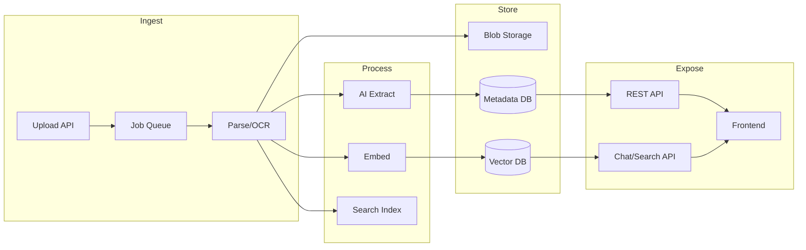

# AI-Driven Document Automation — Case Presentation

**Allegro Nordic | March 13th, 2025**

---

## Slide 1: Problem & Requirements Recap

**Case:** Outline how a modern software solution can automate handling of large volumes of documents — with a focus on CFO workflows.

**Core Requirements:**

- Upload and process large volumes of documents efficiently
- Structure and index document content so that it becomes searchable
- Extract key elements using AI (dates, parties, amounts, key terms)
- Store elements as structured metadata — display and edit in a frontend
- Make document content accessible through AI-based chat or search
- Enable integrations with external systems via APIs

**Additional CFO-centric Features (implemented):**

- Finance-specific extraction: invoice #, due date, VAT, vendor IBAN, KID, contract value, payment terms, GL account
- Confidence scoring → automatic "Needs Review" flag for uncertain or high-value documents
- CFO review queue: one-click approve / reject workflow
- Audit trail: every extraction version is stored with author + timestamp
- Secure time-limited download URLs (Azure Managed Identity SAS, no static keys)
- Outbound webhooks with HMAC-SHA256 signing — connect to ERP/accounting systems
- CFO dashboard: live stats (total, pending, approved, rejected, failed)

**Focus today:** Architecture, technical approach, and assessment of complexity.

---

## Slide 2: Proposed Architecture



**Flow:** Upload → Queue → Parse (text/OCR) → Blob storage. In parallel: AI extraction → Metadata DB; Embed + full-text index → Search/Vector. Expose via REST (metadata CRUD, search) and Chat API (RAG). Frontend consumes both.

---

## Slide 3: Tech Stack & Rationale

| Layer | Choice | Rationale |
|-------|--------|-----------|
| **Blob storage** | S3 / Azure Blob / GCS | Durability, versioning, lifecycle; scales with volume. |
| **Queue** | SQS / RabbitMQ / Redis (Bull) | Decouple upload from processing; retries, DLQ; at-least-once. |
| **Document parsing** | Apache Tika + PyMuPDF | Tika: many formats; PDF libs for better text/table extraction. |
| **OCR** | Tesseract or cloud (Textract) | Trade-off: cost vs accuracy; cloud = variable cost at scale. |
| **AI extraction** | LLM (structured output) or Document AI | Schema-based extraction; validate & retry; cost per doc. |
| **Embeddings** | OpenAI / Cohere / open model | Latency, cost, privacy; batch for bulk. |
| **Vector DB** | pgvector / Pinecone / Weaviate | pgvector = one less system, good for moderate scale. |
| **Metadata DB** | PostgreSQL | Relational metadata, JSONB for flexible fields, FTS possible. |
| **Search** | Postgres FTS / Elasticsearch | FTS enough for many B2B cases; Elasticsearch when scale demands. |
| **API** | REST (Node/Python/Go) | Stateless, versioned, auth (API key/OAuth). |
| **Frontend** | React / Next.js (concept) | List/detail/edit metadata + chat UI. |

**Trade-off:** Managed services reduce ops; self-hosted (MinIO, RabbitMQ, pgvector) can lower cloud cost with higher ops.

---

## Slide 4: Document Processing Flow (Upload → Structured Data)

1. **Upload** — API validates type/size, stores file in blob, enqueues job(s) (one per doc or batch).
2. **Parse** — Worker downloads from blob, runs Tika + PDF lib; extracts text (and layout if needed); stores raw text; on failure → retry then DLQ.
3. **Extract** — Worker sends text to LLM/document AI with schema (dates, parties, amounts, terms); validates output; writes to metadata DB; optional human-in-the-loop for low confidence.
4. **Index** — Full-text index for search; chunk text → embed → vector DB for RAG.
5. **APIs** — REST for metadata CRUD, search, job status; chat endpoint: RAG (retrieve from vector + FTS, then LLM).

**Scale:** Stateless workers; queue depth drives scaling; monitor blob and DB throughput and connection pools.

---

## Slide 5: Scaling for Large Volumes

- **Ingest:** Rate limit per tenant; batch small files where useful; partition queue by tenant/priority if needed.
- **Workers:** Scale worker count with queue depth (e.g. Kubernetes HPA, or serverless on queue); idempotent jobs (key by document id).
- **DB:** Connection pooling (e.g. PgBouncer); read replicas for search/chat; partition or shard metadata by tenant/date if needed.
- **Vector DB:** Shard by tenant; approximate search (HNSW/IVF); batch embedding requests.
- **Cost:** Spot/preemptible for non-critical workers; blob lifecycle (e.g. cold storage after 90 days); monitor AI token/docs cost.

---

## Slide 6: CFO Workflow — Key Capabilities

```
Invoice / Contract PDF
        ↓
AI extracts: vendor · amount · due date · KID / ref · VAT · payment terms
        ↓
Confidence < 70% OR amount > NOK 100,000?
→ Flagged "Needs Review" automatically
        ↓
CFO opens Review Queue → one-click Approve / Reject
→ Full audit trail: who approved, when, what version of extraction
        ↓
Approved → outbound webhook to ERP / accounting system
   (HMAC-SHA256 signed; delivery log with retry visibility)
        ↓
CFO downloads original via secure time-limited SAS URL (1–24 h, no static key)
```

**Result:** Every financial document goes from inbox → structured data → ERP-integrated with full compliance trail.

---

## Slide 6b: Production Readiness & Cost

**Observability:** Structured logs (structlog), metrics (throughput, latency, error rate per stage), OpenTelemetry tracing across all services.

**Security:** JWT auth + Azure AD on all APIs; tenant isolation in blob and DB; Managed Identity (no passwords/keys); encrypt at rest and in transit; HMAC-signed webhooks; no PII in logs.

**Reliability:** Retries with tenacity, Dead-Letter Queue for failed jobs, idempotent workers, health checks, circuit-breaker on LLM calls.

**Cost per document (Azure, estimated):**

| Component | Cost |
|-----------|------|
| Azure OpenAI GPT-4o extraction (~2 000 tokens) | ~$0.005 |
| Embedding (1 500 tokens) | ~$0.0002 |
| Blob storage per document | ~$0.0001 |
| Azure AI Search indexing | ~$0.001 |
| **Total per document** | **~$0.006 – $0.01** |

At 10 000 docs/month ≈ **$60–100/month** for AI costs. Blob + DB + Container Apps add ~$200–400/month fixed.

**Mitigation:** cache embeddings for re-runs, batch LLM calls, use GPT-4o-mini for first-pass extraction.

---

## Slide 7: Estimated Development Time

| Component | Estimate | Assumptions |
|-----------|----------|-------------|
| Ingest (upload API, queue, parse, blob) | 2–3 weeks | One backend dev; queue + workers chosen. |
| AI extraction — core fields | 2–3 weeks | Schema defined; one document type first. |
| CFO finance-specific extraction + review queue | 1–1.5 weeks | Schema extension + review workflow. |
| Metadata API + CFO dashboard + list/detail/edit | 2–2.5 weeks | REST + full frontend with review UI. |
| Audit trail + download URLs + webhook engine | 1–1.5 weeks | DB migrations + delivery log. |
| Search (full-text + vector index, search API) | 1.5–2 weeks | Index design and embedding pipeline. |
| RAG chat (retrieve + LLM, chat API, simple UI) | 2–2.5 weeks | Embeddings and vector DB in place. |
| ERP/API integrations + auth + docs | 1–2 weeks | Depends on number of external systems. |
| Observability, security, IaC, CI/CD | 2–3 weeks | Across the project. |

**Total (full CFO platform):** ~12–16 weeks (1 dev) or **7–9 weeks (2 devs, clear ownership).**

---

## Slide 8: Next Steps & Open Questions

- **Next steps:** Validate financial extraction schema with your finance team; pilot with 50–100 real invoices to measure confidence scores; connect first webhook to existing ERP.
- **Open questions for Allegro Nordic:** Which ERP/accounting system is in use (Tripletex, Visma, SAP)? Any compliance / data residency constraints (GDPR, NB FSA)? Priority: invoice automation first, or contract management? Existing approval thresholds for CFO sign-off?

**Documentation:** ADRs for key choices; OpenAPI for APIs; runbooks for queue backup and extraction failures; onboarding doc for running pipeline locally and adding document types.

---

*End of slide deck.*
